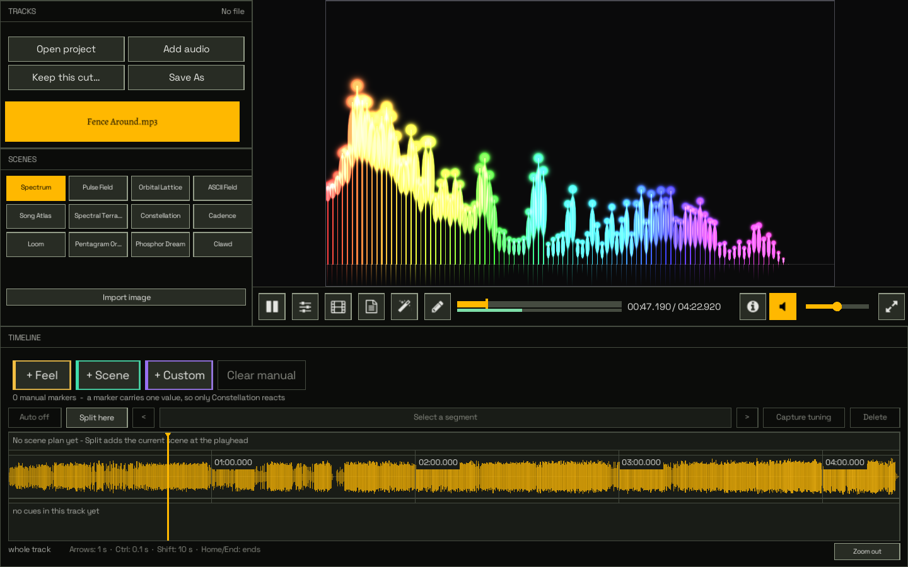

<p align="center">
  
</p>

<h1 align="center">Musializer</h1>

<p align="center">
  <strong>Give your music a video worth watching.</strong><br>
  A music visualization studio for Linux, built in Rust.
</p>

<p align="center">
  <a href="#get-started">Get started</a> ·
  <a href="#make-it-yours">What you can make</a> ·
  <a href="#lyrics-and-assist">Lyrics &amp; Assist</a> ·
  <a href="docs/README.md">Documentation</a>
</p>



Start with a song. Find a scene that suits it, let the bass move the picture,
give the chorus a different look, and put the words where they're sung.
Musializer brings scene direction, timed lyrics, and video export into one
workspace, with playback and preview beside the controls as you work.

## Make it yours

**Twelve scenes to explore.** Try the luminous bars of Spectrum, the shifting
characters of Phosphor Dream, the landscapes of Song Atlas, or Cadence's animated
letterforms. Each scene has its own controls and responds to your track.

**Arrange the whole song.** Split the timeline into scenes, save different tuning
for each section, and place markers for moments you want to emphasize. Connect
volume, beats, spectral changes, or individual frequency bands to scene settings
through adjustable routes.

**Make lyrics part of the picture.** Edit cue text and timing, stack lines, import
a typeface, and choose placement, backing, glow, and shadow. The lyric timeline
supports dragging, splitting, merging, tap timing, and undo.

**Choose your workspace.** Light / blue and Black / amber are available from the
startup screen. Your choice is remembered. Open **Editor** with the pencil button
or **F8** to tune the scene and edit lyric cues beside a fully visible preview.

**Export for where you'll share it.** Render a landscape video, a square post,
or a vertical clip. Export a whole track, a selected time window, or a still.
High and Master quality use supersampling to preserve fine lines and bright
detail. MP4 export supports software encoding and optional NVIDIA encoders.

## Get started

Musializer is built and tested on Linux. You'll need **Rust 1.92 or newer**, a C
compiler, libclang, and the X11/OpenGL development libraries. The window uses X11
or XWayland; raylib 6.0 is bundled with the source.

On Debian/Ubuntu, install the build dependencies and a file picker:

```sh
sudo apt install build-essential pkg-config libclang-dev \
  libx11-dev libxrandr-dev libxinerama-dev libxcursor-dev libxi-dev \
  libgl1-mesa-dev zenity
```

`kdialog` can replace `zenity` on KDE. Install `ffmpeg` for video export and Assist.
The checked-in libclang path targets Debian/Ubuntu on x86-64; on another layout,
set `LIBCLANG_PATH` to the directory containing your libclang shared library.

```sh
git clone https://github.com/wolframs/rusty-musializer.git
cd rusty-musializer
cargo build --release
./target/release/musializer
```

Choose a theme, then **Open audio** or drop a track into the window. You can also
launch directly into a song:

```sh
./target/release/musializer "path/to/song.mp3"
```

1. Choose a scene and press **F8** to try its controls while the music plays.
2. Close Editor to arrange scene changes and timed lyrics on the timeline.
3. Open **Export**, choose the canvas and quality, and render your video.

Save your work as a `.musi` project to return to its scenes, tuning, routes, and
lyrics. To add Musializer to your application menu and associate project files:

```sh
tools/install-linux-launcher.sh
```

Fonts and shaders are embedded; launching from another directory works too.

## Lyrics and Assist

Assist can analyze a track, suggest scene changes, and propose lyric timings.
Results are staged for review before you apply them to the project.

Local workflows use optional Python and audio-model tools. An experimental,
opt-in **Antigravity / Gemini audio route** can listen to short overlapping clips
and propose the phrases actually performed, including repeats and echoes. It
uses an installed, authenticated Antigravity ACP runtime and asks you to confirm
audio transfer for each job. Hosted OpenRouter workflows are also optional.

Automatic lyric timing is still being improved. Review the proposed words and
boundaries against playback; accuracy across whole tracks is not yet established.
You can always author and adjust cues manually.

Check which optional tools are available without starting a model or sending
audio:

```sh
python3 tools/musializer_doctor.py
python3 tools/musializer_doctor.py --require local_lyrics
```

See the [Assist guide](docs/ASSIST_PIPELINE.md) for setup and how proposals are
validated, or [analysis adapters](tools/ANALYSIS_ADAPTERS.md) for dependencies and
data handling.

<details>
<summary><strong>Render a saved project from the command line</strong></summary>

```sh
./target/release/musializer \
  --project performance.musi \
  --render performance.mp4 \
  --resolution 1080x1920 \
  --fps 30 \
  --quality master
```

Add `--render-window 30 15` to export 15 seconds starting at the 30-second mark.
Preview and export use the same scene, route, and timeline evaluation.
Run `./target/release/musializer --help` for all options.

</details>

## Build on it

The renderer and audio engine use **raylib 6.0**. **egui 0.35** powers the new
Tune / Lyrics Editor and theme picker; the other panels are still being migrated.
The pure Rust core owns analysis, project data, and timing. Runtime code handles
audio devices, files, and helper processes.

```sh
tools/verify.sh --quick    # formatting, tests, lint, and offline checks
tools/verify.sh            # also captures and checks the app in private Xvfb
cargo build --release     # refresh the application you'll run
```

Automated playback is muted per process and isolated from desktop audio, with
the real decoded signal still reaching the analyzer. The optional
[Listening Lab](tools/listening-lab/) supports synchronized A/B listening and
timed-lyric comparisons when a judgment needs human ears.

| Looking for… | Start here |
| --- | --- |
| Editor behavior and themes | [UI toolkit](docs/UI_TOOLKIT.md) |
| Code ownership and data flows | [Architecture](docs/CODE_ARCHITECTURE.md) |
| A module or command | [Code map](docs/CODE_MAP.md) · [CLI and formats](docs/PHASE0_INVENTORY.md) |
| Open product work | [Development queue](FEATURE_PARITY_PLAN.md) |
| Engineering and verification rules | [Repository guide](AGENTS.md) |
| Everything else | [Documentation index](docs/README.md) |

Musializer is an actively developed application. The earlier C implementation is
archived; this repository is the home of the product.

## License

[MIT](LICENSE) for first-party code. Bundled libraries and fonts retain their own
licenses alongside their sources, including raylib, the egui rendering adapter,
Space Grotesk, Alegreya, and Font Awesome.
